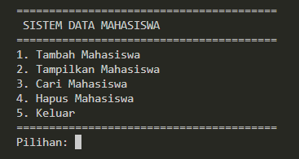

# Sistem Data Mahasiswa

Nama: Naufal Nararya Aydinullah <br>
NRP: 5025241251 <br>
Kelas: C <br>

## 1. Tampilan Menu Utama

Saat program pertama kali dijalankan, pengguna akan melihat menu utama yang berisi beberapa pilihan. Pengguna dapat memilih fitur yang ingin digunakan dengan memasukkan nomor sesuai menu.



Menu yang tersedia:
- 1. Tambah Mahasiswa
- 2. Tampilkan Mahasiswa
- 3. Cari Mahasiswa
- 4. Hapus Mahasiswa
- 5. Keluar

 ## 2. Tambah Mahasiswa

Fitur ini digunakan untuk menambahkan data mahasiswa baru ke dalam sistem. Pengguna perlu memasukkan NIM, nama, program studi, dan IPK. Setelah semua data dimasukkan dengan benar, data mahasiswa akan disimpan ke dalam sistem.

```csharp
  static void TambahMahasiswa()
        {
            Console.Clear();

            Console.WriteLine("========================================");
            Console.WriteLine(" TAMBAH MAHASISWA");
            Console.WriteLine("========================================");

            Console.Write("NIM : ");
            string nim = Console.ReadLine();

            Console.Write("Nama : ");
            string nama = Console.ReadLine();

            Console.Write("Program Studi : ");
            string prodi = Console.ReadLine();

            double ipk;

            while (true)
            {
                Console.Write("IPK : ");

                if (double.TryParse(
                    Console.ReadLine(),
                    out ipk))
                {
                    if (ipk >= 0 && ipk <= 4)
                    {
                        break;
                    }
                }

                Console.WriteLine(
                    "IPK harus berupa angka 0 - 4."
                );
            }

            Mahasiswa mahasiswa =
                new Mahasiswa(
                    nim,
                    nama,
                    prodi,
                    ipk
                );

            daftarMahasiswa.Add(mahasiswa);

            Console.WriteLine();
            Console.WriteLine(
                "Data mahasiswa berhasil ditambahkan."
            );
        }
```
## 3. Tampilkan Mahasiswa

Fitur ini digunakan untuk menampilkan seluruh data mahasiswa yang sudah ditambahkan. Data akan ditampilkan dalam bentuk tabel yang berisi NIM, nama, program studi, dan IPK sehingga lebih mudah untuk dilihat.

```csharp
      static void TampilkanMahasiswa()
        {
            Console.Clear();

            Console.WriteLine("==========================================================");
            Console.WriteLine(" DAFTAR MAHASISWA");
            Console.WriteLine("==========================================================");

            if (daftarMahasiswa.Count == 0)
            {
                Console.WriteLine(
                    "Belum ada data mahasiswa."
                );

                return;
            }

            Console.WriteLine(
                "{0,-12} {1,-20} {2,-20} {3,5}",
                "NIM",
                "Nama",
                "Prodi",
                "IPK"
            );

            Console.WriteLine(
                "----------------------------------------------------------"
            );

            foreach (Mahasiswa m in daftarMahasiswa)
            {
                Console.WriteLine(
                    "{0,-12} {1,-20} {2,-20} {3,5:F2}",
                    m.NIM,
                    m.Nama,
                    m.Prodi,
                    m.IPK
                );
            }

            Console.WriteLine(
                "=========================================================="
            );
        }
```
## 4. Cari Mahasiswa

Fitur ini digunakan untuk mencari data mahasiswa berdasarkan NIM. Pengguna cukup memasukkan NIM yang ingin dicari, kemudian program akan memeriksa data yang sudah tersimpan. Jika ditemukan, data mahasiswa akan ditampilkan.

```csharp
   static void CariMahasiswa()
        {
            Console.Clear();

            Console.WriteLine("========================================");
            Console.WriteLine(" CARI MAHASISWA");
            Console.WriteLine("========================================");

            Console.Write("Masukkan NIM: ");
            string nimCari = Console.ReadLine();

            Mahasiswa mahasiswaDitemukan = null;

            foreach (Mahasiswa m in daftarMahasiswa)
            {
                if (m.NIM.Equals(
                    nimCari,
                    StringComparison.OrdinalIgnoreCase))
                {
                    mahasiswaDitemukan = m;
                    break;
                }
            }

            Console.WriteLine();

            if (mahasiswaDitemukan != null)
            {
                Console.WriteLine("Data ditemukan!");

                Console.WriteLine(
                    "NIM : " + mahasiswaDitemukan.NIM
                );

                Console.WriteLine(
                    "Nama : " + mahasiswaDitemukan.Nama
                );

                Console.WriteLine(
                    "Prodi : " + mahasiswaDitemukan.Prodi
                );

                Console.WriteLine(
                    "IPK : " + mahasiswaDitemukan.IPK.ToString("F2")
                );
            }
            else
            {
                Console.WriteLine(
                    "Mahasiswa dengan NIM tersebut tidak ditemukan."
                );
            }
        }
```

## 5. Hapus Mahasiswa

Fitur ini digunakan untuk menghapus data mahasiswa yang sudah tersimpan. Pengguna memasukkan NIM mahasiswa yang ingin dihapus, kemudian program akan mencari data tersebut. Jika ditemukan, data akan dihapus dari sistem.

```csharp
   static void HapusMahasiswa()
        {
            Console.Clear();

            Console.WriteLine("========================================");
            Console.WriteLine(" HAPUS MAHASISWA");
            Console.WriteLine("========================================");

            Console.Write("Masukkan NIM: ");
            string nimHapus = Console.ReadLine();

            Mahasiswa mahasiswaDitemukan = null;

            foreach (Mahasiswa m in daftarMahasiswa)
            {
                if (m.NIM.Equals(
                    nimHapus,
                    StringComparison.OrdinalIgnoreCase))
                {
                    mahasiswaDitemukan = m;
                    break;
                }
            }

            if (mahasiswaDitemukan != null)
            {
                daftarMahasiswa.Remove(
                    mahasiswaDitemukan
                );

                Console.WriteLine();
                Console.WriteLine(
                    "Data mahasiswa berhasil dihapus."
                );
            }
            else
            {
                Console.WriteLine();
                Console.WriteLine(
                    "Data mahasiswa tidak ditemukan."
                );
            }
        }
    }
}
```
## 6. Keluar

Fitur ini digunakan untuk mengakhiri penggunaan program. Ketika pengguna memilih menu nomor 5, program akan menampilkan pesan terima kasih dan kemudian keluar dari perulangan menu.

```csharp
case 5:
    Console.WriteLine(
        "Terima kasih telah menggunakan program."
    );
    break;
```
